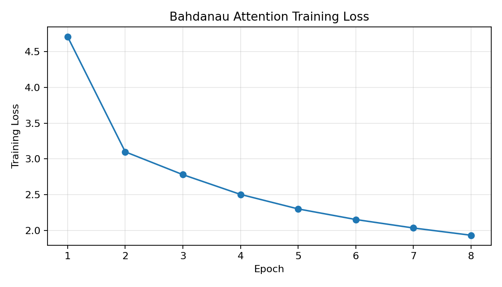
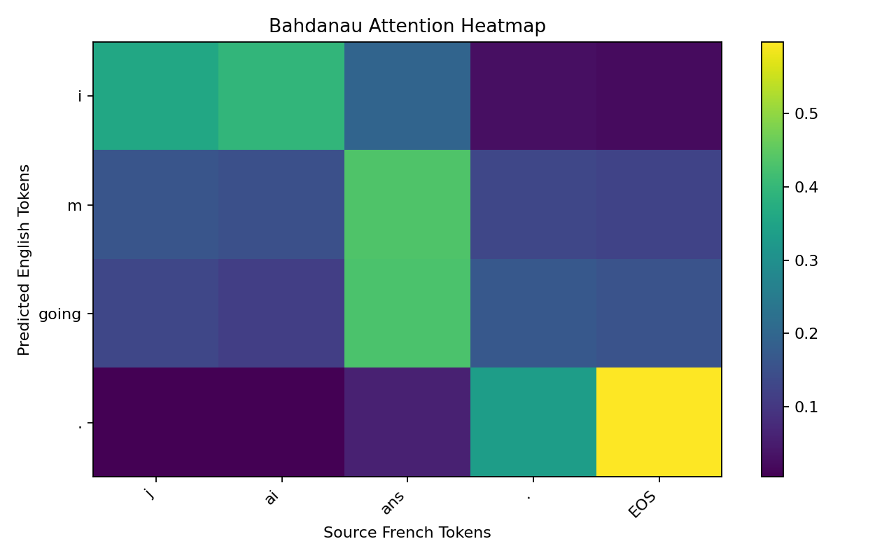

# Bahdanau Attention Translation Practice

## 1. 실습 개요

본 폴더는 `mhauskn/pytorch_attention`의 Bahdanau Attention 기반 PyTorch seq2seq 예제 코드를 참고하여 Colab에서 직접 실행한 실습 결과다.

원본 repository는 영어-프랑스어 번역 데이터를 사용하여 attention 기반 encoder-decoder 모델을 학습하는 구조다.
본 실습에서는 원본 구조를 바탕으로 데이터 다운로드, 전처리, 모델 학습, attention 시각화, 결과 저장, GitHub 업로드까지 하나의 Colab 파이프라인으로 구성했다.

## 2. 원본 코드 기반 구조

원본 repository의 핵심 파일 구조는 다음과 같다.

- `load_data.py`: 영어-프랑스어 데이터 로드 및 vocabulary 구성
- `model.py`: EncoderRNN, BahdanauAttention, AttnDecoder, EncoderDecoder 정의
- `train.py`: 학습 loop 및 greedy decoding 실행

본 실습 코드도 같은 구조를 유지하되, Colab 실행 안정성과 주석 설명을 보완했다.

## 3. 이론적 배경

Bahdanau Attention은 2015년 `Neural Machine Translation by Jointly Learning to Align and Translate` 논문에서 제안된 additive attention 방식이다.

기존 encoder-decoder 모델은 source sentence 전체를 하나의 고정 길이 vector에 압축해야 했다.
이 방식은 문장이 길어질수록 정보 병목이 발생할 수 있다.

Bahdanau Attention은 decoder가 매 target 시점마다 encoder hidden state 전체를 다시 참조하도록 만든다.
즉, target token을 생성할 때 source 문장의 어느 위치에 집중할지 alignment score를 학습한다.

핵심 수식은 다음과 같다.

`e_{t,i} = v_a^T tanh(W_a s_{t-1} + U_a h_i)`

`alpha_{t,i} = softmax(e_{t,i})`

`c_t = sum_i alpha_{t,i} h_i`

여기서 `alpha_{t,i}`는 target 시점 `t`에서 source 위치 `i`에 대한 attention weight다.

## 4. 실행 환경

- Device: cuda
- PyTorch: 2.10.0+cu128
- Epochs: 8
- Batch size: 64
- Hidden size: 128
- Learning rate: 0.0003
- Max length: 10
- Training pairs: 10599
- Input vocab size: 4346
- Output vocab size: 2804

## 5. 학습 로그

아래 로그는 Colab에서 실제 학습을 수행하면서 기록한 epoch별 training loss다.

```text
================================================================================
Bahdanau Attention Training Log
Started at: 2026-04-28 06:55:01
Device: cuda
PyTorch: 2.10.0+cu128
Epochs: 8
Batch size: 64
Hidden size: 128
Learning rate: 0.0003
Training pairs: 10599
Input vocab size: 4346
Output vocab size: 2804
================================================================================
Epoch 01/8 | train_loss=4.7089 | epoch_seconds=5.1
Epoch 02/8 | train_loss=3.0993 | epoch_seconds=3.9
Epoch 03/8 | train_loss=2.7800 | epoch_seconds=4.0
Epoch 04/8 | train_loss=2.5038 | epoch_seconds=3.9
Epoch 05/8 | train_loss=2.3009 | epoch_seconds=3.9
Epoch 06/8 | train_loss=2.1528 | epoch_seconds=3.9
Epoch 07/8 | train_loss=2.0343 | epoch_seconds=3.9
Epoch 08/8 | train_loss=1.9327 | epoch_seconds=3.9
================================================================================
Finished at: 2026-04-28 06:55:34
Total training seconds: 32.6
Final train loss: 1.9327
================================================================================

Sample Translation Results
--------------------------------------------------------------------------------
{"source_french": "j ai ans .", "target_english": "i m .", "predicted_english": "i m going ."}
{"source_french": "je vais bien .", "target_english": "i m ok .", "predicted_english": "i m going to be ."}
{"source_french": "ca va .", "target_english": "i m ok .", "predicted_english": "i m going to ."}
{"source_french": "je suis gras .", "target_english": "i m fat .", "predicted_english": "i m ."}
{"source_french": "je suis gros .", "target_english": "i m fat .", "predicted_english": "i m a ."}
{"source_french": "je suis en forme .", "target_english": "i m fit .", "predicted_english": "i m in the same ."}
{"source_french": "je suis touche !", "target_english": "i m hit !", "predicted_english": "i m sorry ."}
{"source_french": "je suis touchee !", "target_english": "i m hit !", "predicted_english": "i m going to be ."}
```

## 6. 학습 결과

- Final train loss: 1.9327
- Training time: 32.6 seconds

학습 loss 그래프는 `training_loss.png`에 저장했다.



## 7. Attention 시각화

`attention_heatmap.png`는 decoder가 target token을 생성할 때 source token의 어느 위치를 참고했는지 보여준다.
이 heatmap은 Bahdanau attention의 alignment 학습 결과를 직관적으로 확인하기 위한 시각화다.



## 8. 샘플 번역 결과

```json
[
  {
    "source_french": "j ai ans .",
    "target_english": "i m .",
    "predicted_english": "i m going ."
  },
  {
    "source_french": "je vais bien .",
    "target_english": "i m ok .",
    "predicted_english": "i m going to be ."
  },
  {
    "source_french": "ca va .",
    "target_english": "i m ok .",
    "predicted_english": "i m going to ."
  },
  {
    "source_french": "je suis gras .",
    "target_english": "i m fat .",
    "predicted_english": "i m ."
  },
  {
    "source_french": "je suis gros .",
    "target_english": "i m fat .",
    "predicted_english": "i m a ."
  },
  {
    "source_french": "je suis en forme .",
    "target_english": "i m fit .",
    "predicted_english": "i m in the same ."
  },
  {
    "source_french": "je suis touche !",
    "target_english": "i m hit !",
    "predicted_english": "i m sorry ."
  },
  {
    "source_french": "je suis touchee !",
    "target_english": "i m hit !",
    "predicted_english": "i m going to be ."
  }
]
```

## 9. 제출 파일 목록

- `README.md`: 실습 설명 및 결과 요약
- `annotated_bahdanau_attention.py`: 원 논문 개념과 연결한 주석 강화 모델 코드
- `metrics.json`: 학습 설정, loss history, sample translation 결과
- `training_log.txt`: Colab에서 실행한 epoch별 학습 로그
- `training_loss.png`: epoch별 training loss 그래프
- `attention_heatmap.png`: attention weight 시각화
- `ORIGINAL_REPOSITORY_README.md`: 원본 repository README 참고본
- `ORIGINAL_model.py`: 원본 model.py 참고본
- `ORIGINAL_load_data.py`: 원본 load_data.py 참고본
- `ORIGINAL_train.py`: 원본 train.py 참고본

## 10. 학습하며 이해한 점

Bahdanau Attention은 번역 과정에서 source sentence 전체를 하나의 vector로만 압축하지 않고, target token을 생성하는 각 시점마다 source hidden state 전체를 다시 참조하는 구조다.
이를 통해 decoder는 source 문장의 특정 위치에 동적으로 집중할 수 있다.
본 실습에서는 attention weight를 heatmap으로 시각화하여, 모델이 source token별 중요도를 어떻게 분배하는지 확인했다.

## 11. 참고 자료

- https://github.com/mhauskn/pytorch_attention
- https://download.pytorch.org/tutorial/data.zip
- Bahdanau, Cho, Bengio, 2015, Neural Machine Translation by Jointly Learning to Align and Translate
