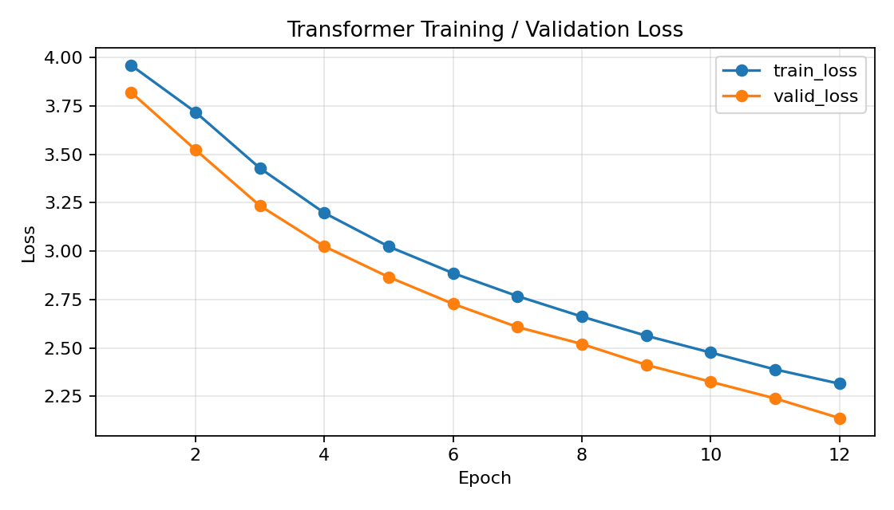
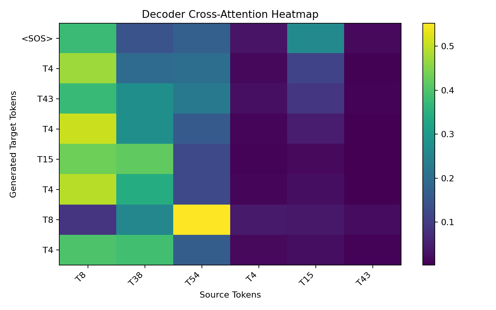

# Transformer Practice Based on hyunwoongko/transformer

## 1. 실습 개요

본 폴더는 `hyunwoongko/transformer` repository를 참고하여 Transformer 구조를 Colab에서 직접 실행한 실습 결과다.

원본 repository는 `Attention Is All You Need` 논문의 Transformer 구조를 PyTorch로 구현한 예제이며, README에는 Positional Encoding, Multi-Head Attention, Scaled Dot-Product Attention, LayerNorm, Position-wise Feed Forward, Encoder/Decoder 구조가 정리되어 있다.

원본 실험은 Multi30K 번역 데이터셋을 기반으로 하지만, 최신 Colab 환경에서는 torchtext와 Multi30K 의존성 충돌이 발생할 수 있다. 따라서 본 실습에서는 원본 구조를 참고하되, Colab에서 안정적으로 학습 가능한 toy reverse-sequence task를 사용했다.

## 2. 실습 Task

본 실습의 task는 입력 sequence를 뒤집어 출력하는 sequence-to-sequence 문제다.

예시:

```text
source: T8 T15 T23 T7
target: T7 T23 T15 T8 <EOS>
```

이 task는 실제 번역 문제는 아니지만, Transformer의 encoder-decoder 구조, masked self-attention, encoder-decoder cross-attention, autoregressive decoding이 정상적으로 작동하는지 검증하기에 적합하다.

## 3. 원 논문과 코드 연결

Transformer는 recurrence나 convolution 없이 attention mechanism만으로 sequence transduction을 수행하는 구조다.

핵심 attention 수식은 다음과 같다.

`Attention(Q, K, V) = softmax(QK^T / sqrt(d_k))V`

본 코드에서는 `ScaledDotProductAttention` 클래스가 이 수식을 구현한다.

Multi-Head Attention은 여러 개의 attention head를 병렬로 사용한다.
각 head는 서로 다른 projection을 통해 token 간 관계를 다른 관점에서 학습한다.

Decoder에서는 두 가지 attention이 사용된다.

- Masked self-attention: target sequence 내부에서 미래 token을 보지 못하게 한다.
- Encoder-decoder attention: decoder query가 encoder output을 key/value로 참조한다.

## 4. 모델 구성

- `PositionalEncoding`: sin/cos 기반 위치 정보 주입
- `ScaledDotProductAttention`: Q, K, V 기반 attention score 계산
- `MultiHeadAttention`: 여러 attention head 병렬 적용
- `EncoderLayer`: self-attention + FFN + residual + LayerNorm
- `DecoderLayer`: masked self-attention + cross-attention + FFN
- `Transformer`: encoder와 decoder를 결합한 전체 모델

## 5. 실행 환경

- Device: cuda
- PyTorch: 2.10.0+cu128
- Vocab size: 60
- Train samples: 6000
- Valid samples: 1000
- d_model: 64
- n_head: 4
- n_layers: 2
- ffn_hidden: 256
- batch_size: 128
- epochs: 12
- learning_rate: 0.0003
- trainable parameters: 245052

## 6. 학습 로그

```text
================================================================================
Transformer Training Log
Started at: 2026-05-02 18:20:58
Device: cuda
PyTorch: 2.10.0+cu128
Task: reverse sequence toy seq2seq
Vocab size: 60
Train samples: 6000
Valid samples: 1000
D_MODEL: 64
N_HEAD: 4
N_LAYERS: 2
FFN_HIDDEN: 256
BATCH_SIZE: 128
EPOCHS: 12
LEARNING_RATE: 0.0003
Trainable parameters: 245052
================================================================================
Epoch 01/12 | train_loss=3.9599 | valid_loss=3.8203 | train_token_acc=0.1095 | valid_token_acc=0.1258 | epoch_seconds=2.0
Epoch 02/12 | train_loss=3.7179 | valid_loss=3.5233 | train_token_acc=0.1376 | valid_token_acc=0.1648 | epoch_seconds=1.0
Epoch 03/12 | train_loss=3.4285 | valid_loss=3.2344 | train_token_acc=0.1718 | valid_token_acc=0.2031 | epoch_seconds=1.0
Epoch 04/12 | train_loss=3.1972 | valid_loss=3.0244 | train_token_acc=0.1996 | valid_token_acc=0.2214 | epoch_seconds=1.0
Epoch 05/12 | train_loss=3.0234 | valid_loss=2.8659 | train_token_acc=0.2214 | valid_token_acc=0.2305 | epoch_seconds=1.0
Epoch 06/12 | train_loss=2.8860 | valid_loss=2.7273 | train_token_acc=0.2335 | valid_token_acc=0.2404 | epoch_seconds=1.1
Epoch 07/12 | train_loss=2.7672 | valid_loss=2.6074 | train_token_acc=0.2438 | valid_token_acc=0.2527 | epoch_seconds=1.0
Epoch 08/12 | train_loss=2.6615 | valid_loss=2.5200 | train_token_acc=0.2551 | valid_token_acc=0.2559 | epoch_seconds=1.0
Epoch 09/12 | train_loss=2.5624 | valid_loss=2.4122 | train_token_acc=0.2684 | valid_token_acc=0.2810 | epoch_seconds=1.0
Epoch 10/12 | train_loss=2.4758 | valid_loss=2.3248 | train_token_acc=0.2798 | valid_token_acc=0.2951 | epoch_seconds=1.0
Epoch 11/12 | train_loss=2.3885 | valid_loss=2.2387 | train_token_acc=0.2972 | valid_token_acc=0.3064 | epoch_seconds=1.0
Epoch 12/12 | train_loss=2.3150 | valid_loss=2.1373 | train_token_acc=0.3107 | valid_token_acc=0.3323 | epoch_seconds=1.0
================================================================================
Finished at: 2026-05-02 18:21:11
Total training seconds: 12.8
Final train loss: 2.3150
Final valid loss: 2.1373
Final valid token accuracy: 0.3323
================================================================================

Sample Prediction Results
--------------------------------------------------------------------------------
{"source": "T8 T38 T54 T4 T15 T43", "target_reversed": "T43 T15 T4 T54 T38 T8 <EOS>", "predicted": "<SOS> T4 T43 T4 T15 T4 T8 T4 <EOS>"}
{"source": "T26 T46 T43 T41 T40 T35", "target_reversed": "T35 T40 T41 T43 T46 T26 <EOS>", "predicted": "<SOS> T40 T35 T46 T41 T46 T41 T46 <EOS>"}
{"source": "T53 T18 T50 T33 T54 T40 T16", "target_reversed": "T16 T40 T54 T33 T50 T18 T53 <EOS>", "predicted": "<SOS> T40 T53 T33 T40 T54 T33 T40 T53 T50 T53 T50 T53 <EOS>"}
{"source": "T57 T26 T35 T58 T41 T24 T52 T26", "target_reversed": "T26 T52 T24 T41 T58 T35 T26 T57 <EOS>", "predicted": "<SOS> T26 T24 T52 T57 T59 T57 T59 T57 <EOS>"}
{"source": "T40 T45 T56 T13", "target_reversed": "T13 T56 T45 T40 <EOS>", "predicted": "<SOS> T40 T56 T40 T45 T40 <EOS>"}
{"source": "T50 T32 T21 T47 T9 T8", "target_reversed": "T8 T9 T47 T21 T32 T50 <EOS>", "predicted": "<SOS> T9 T8 T21 T47 T9 <EOS>"}
```

## 7. 학습 결과

- Final train loss: 2.3150
- Final valid loss: 2.1373
- Final valid token accuracy: 0.3323
- Training time: 12.8 seconds

학습 loss 그래프는 `training_loss.png`에 저장했다.



## 8. Attention 시각화

`attention_heatmap.png`는 마지막 decoder layer의 encoder-decoder cross-attention을 시각화한 결과다.

가로축은 source token이고, 세로축은 decoder가 생성한 target token이다.
색이 진할수록 해당 target token을 생성할 때 해당 source token을 더 강하게 참조했다는 의미다.



## 9. 샘플 예측 결과

```json
[
  {
    "source": "T8 T38 T54 T4 T15 T43",
    "target_reversed": "T43 T15 T4 T54 T38 T8 <EOS>",
    "predicted": "<SOS> T4 T43 T4 T15 T4 T8 T4 <EOS>"
  },
  {
    "source": "T26 T46 T43 T41 T40 T35",
    "target_reversed": "T35 T40 T41 T43 T46 T26 <EOS>",
    "predicted": "<SOS> T40 T35 T46 T41 T46 T41 T46 <EOS>"
  },
  {
    "source": "T53 T18 T50 T33 T54 T40 T16",
    "target_reversed": "T16 T40 T54 T33 T50 T18 T53 <EOS>",
    "predicted": "<SOS> T40 T53 T33 T40 T54 T33 T40 T53 T50 T53 T50 T53 <EOS>"
  },
  {
    "source": "T57 T26 T35 T58 T41 T24 T52 T26",
    "target_reversed": "T26 T52 T24 T41 T58 T35 T26 T57 <EOS>",
    "predicted": "<SOS> T26 T24 T52 T57 T59 T57 T59 T57 <EOS>"
  },
  {
    "source": "T40 T45 T56 T13",
    "target_reversed": "T13 T56 T45 T40 <EOS>",
    "predicted": "<SOS> T40 T56 T40 T45 T40 <EOS>"
  },
  {
    "source": "T50 T32 T21 T47 T9 T8",
    "target_reversed": "T8 T9 T47 T21 T32 T50 <EOS>",
    "predicted": "<SOS> T9 T8 T21 T47 T9 <EOS>"
  }
]
```

## 10. 제출 파일 목록

- `README.md`: 실습 설명 및 결과 요약
- `annotated_transformer_model.py`: 논문 개념과 연결한 주석 강화 코드
- `metrics.json`: 학습 설정, loss history, sample prediction 결과
- `training_log.txt`: Colab 학습 로그
- `training_loss.png`: train/validation loss 그래프
- `attention_heatmap.png`: decoder cross-attention 시각화
- `transformer_toy_state_dict.pt`: 학습된 toy Transformer 가중치
- `original_hyunwoongko_transformer_snapshot/`: 원본 repo 참고 파일 스냅샷

## 11. 원본 참고 자료

- https://github.com/hyunwoongko/transformer
- https://arxiv.org/abs/1706.03762
- Vaswani et al., 2017, Attention Is All You Need
