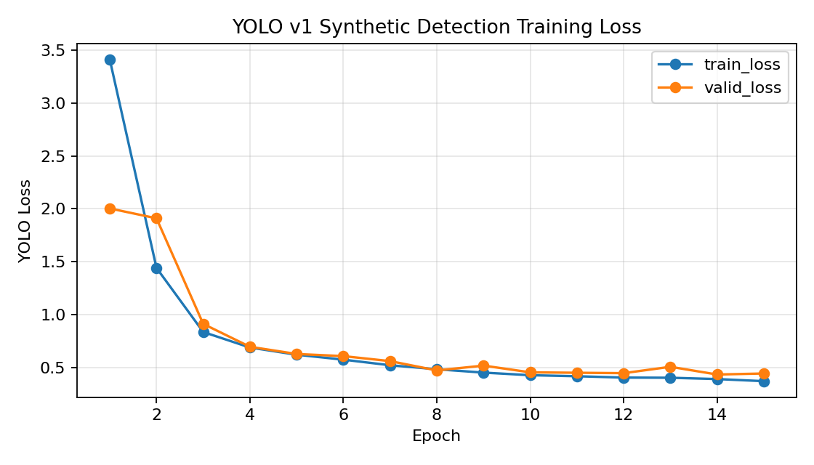
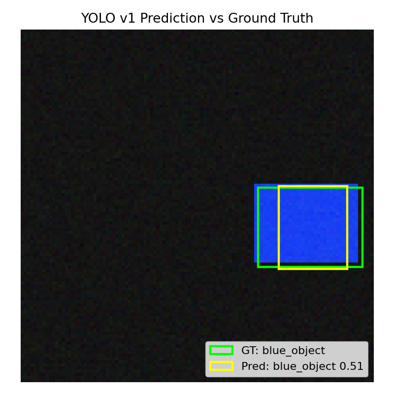
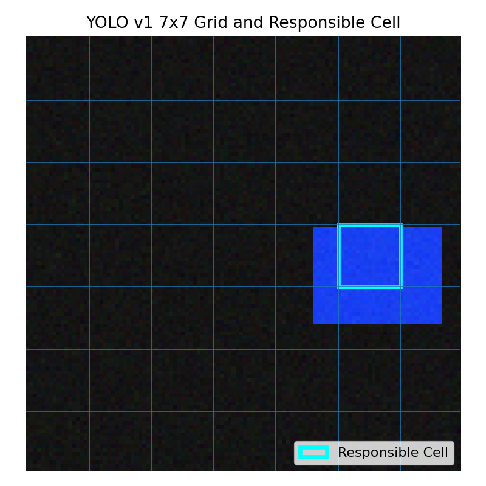

# YOLO v1 Architecture Practice Based on nsoul97/yolov1_pytorch

## 1. 실습 개요

본 폴더는 `nsoul97/yolov1_pytorch` repository를 참고하여 YOLO v1의 핵심 구조를 Colab에서 직접 구현하고 학습한 결과다.

원본 repository는 `You Only Look Once: Unified, Real-Time Object Detection` 논문을 PyTorch로 scratch 구현한 예제이며, ImageNet pretraining, PASCAL VOC 2007/2012 training, VOC 2007 test evaluation 흐름을 포함한다.

다만 VOC 전체 학습은 Colab 실습용으로 무겁기 때문에, 본 실습에서는 YOLO v1의 핵심 개념인 `S x S grid`, `B bounding boxes`, `confidence`, `class probability`, `YOLO loss`를 synthetic single-object detection task로 재현했다.

## 2. 원본 repository 기반 구조

원본 repository는 YOLO 논문을 PyTorch로 scratch 구현한 project다.

README 기준 원본 repository는 다음 내용을 포함한다.

- ImageNet pretraining
- PASCAL VOC 2007 + 2012 training
- PASCAL VOC 2007 test evaluation
- mAP 기반 성능 비교
- prediction visualization

본 실습 코드는 원본의 전체 VOC 재현이 아니라, YOLO v1의 구조와 loss를 이해하기 위한 lightweight reproduction이다.

## 3. YOLO v1 핵심 개념

YOLO v1은 object detection을 하나의 regression 문제로 통합한다.

기존 detection pipeline은 region proposal, classification, bounding box refinement가 분리되어 있었다.
YOLO는 이미지를 한 번만 보고 bounding box와 class probability를 동시에 예측한다.

핵심 구조는 다음과 같다.

- 이미지를 `S x S` grid로 나눈다.
- 객체의 중심이 들어있는 grid cell이 해당 객체를 책임진다.
- 각 cell은 `B`개의 bounding box를 예측한다.
- 각 bounding box는 `x, y, w, h, confidence`를 가진다.
- 각 cell은 `C`개의 class probability를 예측한다.

본 실습에서는 `S=7`, `B=2`, `C=3`으로 설정했다.

## 4. Output Tensor 구조

모델 출력은 다음 형태다.

```text
[batch, S, S, B * 5 + C]
```

본 실습 설정에서는 다음과 같다.

```text
S = 7
B = 2
C = 3
B * 5 + C = 13
output shape = [batch, 7, 7, 13]
```

각 bounding box는 다음 값을 예측한다.

```text
x_cell, y_cell, width, height, confidence
```

`x_cell`, `y_cell`은 grid cell 내부 상대 좌표이고, `width`, `height`는 전체 이미지 기준 normalized size다.

## 5. YOLO Loss

YOLO loss는 크게 세 가지 항으로 구성된다.

### 5.1 Localization Loss

객체가 있는 cell에서 responsible predictor의 bbox 좌표를 학습한다.
YOLO v1 논문처럼 width와 height에는 square root를 적용해 작은 box의 오차가 더 민감하게 반영되도록 했다.

### 5.2 Confidence Loss

YOLO에서 confidence는 `Pr(Object) * IoU`로 해석된다.
따라서 객체가 있는 cell에서는 IoU가 가장 높은 bbox predictor를 responsible predictor로 선택했다.

객체가 없는 cell의 confidence는 0에 가까워지도록 학습한다.

### 5.3 Classification Loss

객체 중심이 들어있는 cell에서 class probability를 학습한다.

### 5.4 Loss Weight

`lambda_coord=5.0`으로 bbox 좌표 학습을 강조했고, `lambda_noobj=0.5`로 no-object confidence loss가 과도하게 커지는 것을 완화했다.

## 6. Synthetic Detection Task

본 실습에서는 이미지마다 하나의 colored rectangle object를 생성했다.

- class 0: red_object
- class 1: green_object
- class 2: blue_object

모델은 객체의 class와 bbox 위치를 예측하도록 학습했다.

## 7. 실행 환경

- Device: cuda
- PyTorch: 2.10.0+cu128
- Image size: 112
- S: 7
- B: 2
- C: 3
- Train samples: 1200
- Valid samples: 200
- Batch size: 64
- Epochs: 15
- Learning rate: 0.0002
- Trainable parameters: 14482445

## 8. 학습 로그

```text
================================================================================
YOLO v1 Synthetic Detection Training Log
Started at: 2026-05-05 12:46:07
Device: cuda
PyTorch: 2.10.0+cu128
Reference repo: nsoul97/yolov1_pytorch
Task: synthetic single-object detection
Image size: 112
S grid: 7
B boxes per cell: 2
C classes: 3
Train samples: 1200
Valid samples: 200
Batch size: 64
Epochs: 15
Learning rate: 0.0002
lambda_coord: 5.0
lambda_noobj: 0.5
Trainable parameters: 14482445
================================================================================
Epoch 01/15 | train_loss=3.4109 | valid_loss=2.0029 | valid_mean_iou=0.0248 | valid_cls_acc=0.3400 | epoch_seconds=2.6
Epoch 02/15 | train_loss=1.4409 | valid_loss=1.9097 | valid_mean_iou=0.0999 | valid_cls_acc=0.3867 | epoch_seconds=0.5
Epoch 03/15 | train_loss=0.8351 | valid_loss=0.9116 | valid_mean_iou=0.4161 | valid_cls_acc=0.9533 | epoch_seconds=0.5
Epoch 04/15 | train_loss=0.6884 | valid_loss=0.6954 | valid_mean_iou=0.4495 | valid_cls_acc=1.0000 | epoch_seconds=0.5
Epoch 05/15 | train_loss=0.6202 | valid_loss=0.6273 | valid_mean_iou=0.4870 | valid_cls_acc=0.9933 | epoch_seconds=0.5
Epoch 06/15 | train_loss=0.5737 | valid_loss=0.6070 | valid_mean_iou=0.4972 | valid_cls_acc=1.0000 | epoch_seconds=0.5
Epoch 07/15 | train_loss=0.5208 | valid_loss=0.5598 | valid_mean_iou=0.5370 | valid_cls_acc=1.0000 | epoch_seconds=0.5
Epoch 08/15 | train_loss=0.4828 | valid_loss=0.4719 | valid_mean_iou=0.5784 | valid_cls_acc=1.0000 | epoch_seconds=0.5
Epoch 09/15 | train_loss=0.4513 | valid_loss=0.5173 | valid_mean_iou=0.5452 | valid_cls_acc=1.0000 | epoch_seconds=0.5
Epoch 10/15 | train_loss=0.4267 | valid_loss=0.4539 | valid_mean_iou=0.6514 | valid_cls_acc=1.0000 | epoch_seconds=0.5
Epoch 11/15 | train_loss=0.4169 | valid_loss=0.4497 | valid_mean_iou=0.6283 | valid_cls_acc=1.0000 | epoch_seconds=0.5
Epoch 12/15 | train_loss=0.4043 | valid_loss=0.4460 | valid_mean_iou=0.6181 | valid_cls_acc=1.0000 | epoch_seconds=0.5
Epoch 13/15 | train_loss=0.4026 | valid_loss=0.5061 | valid_mean_iou=0.6128 | valid_cls_acc=1.0000 | epoch_seconds=0.5
Epoch 14/15 | train_loss=0.3901 | valid_loss=0.4332 | valid_mean_iou=0.6379 | valid_cls_acc=1.0000 | epoch_seconds=0.5
Epoch 15/15 | train_loss=0.3703 | valid_loss=0.4429 | valid_mean_iou=0.6516 | valid_cls_acc=1.0000 | epoch_seconds=0.5
================================================================================
Finished at: 2026-05-05 12:46:21
Total training seconds: 13.9
Final train loss: 0.3703
Final valid loss: 0.4429
Final valid mean IoU: 0.6527
Final valid class accuracy: 1.0000
================================================================================

Sample Detection Results
--------------------------------------------------------------------------------
{"index": 0, "target_class": "blue_object", "target_box_xywh": [0.8161190492766244, 0.5558473723275321, 0.29567956924438477, 0.2248469889163971], "predicted_class": "blue_object", "predicted_score": 0.5101814270019531, "predicted_box_xywh": [0.8239169120788574, 0.5571401715278625, 0.1938742697238922, 0.23528283834457397], "predicted_cell": [5, 3], "predicted_box_predictor": 0}
{"index": 1, "target_class": "red_object", "target_box_xywh": [0.2890298180282116, 0.22414307934897287, 0.2243179827928543, 0.3529384732246399], "predicted_class": "red_object", "predicted_score": 0.18856008350849152, "predicted_box_xywh": [0.3007212281227112, 0.21818839013576508, 0.2537601888179779, 0.253042072057724], "predicted_cell": [2, 1], "predicted_box_predictor": 0}
{"index": 2, "target_class": "red_object", "target_box_xywh": [0.23706271818705968, 0.43417240572827204, 0.22710074484348297, 0.1841491013765335], "predicted_class": "red_object", "predicted_score": 0.2663821280002594, "predicted_box_xywh": [0.21989448368549347, 0.4106571674346924, 0.25653088092803955, 0.2770344913005829], "predicted_cell": [1, 2], "predicted_box_predictor": 0}
{"index": 3, "target_class": "blue_object", "target_box_xywh": [0.3138822615146637, 0.5628830109323774, 0.23398546874523163, 0.19300122559070587], "predicted_class": "blue_object", "predicted_score": 0.22970637679100037, "predicted_box_xywh": [0.29416483640670776, 0.5586933493614197, 0.32137513160705566, 0.3885039985179901], "predicted_cell": [2, 3], "predicted_box_predictor": 1}
{"index": 4, "target_class": "red_object", "target_box_xywh": [0.5877050970281873, 0.6750730616705758, 0.17999356985092163, 0.3294733464717865], "predicted_class": "red_object", "predicted_score": 0.2763672471046448, "predicted_box_xywh": [0.5872442126274109, 0.6669409871101379, 0.1787576824426651, 0.2893514037132263], "predicted_cell": [4, 4], "predicted_box_predictor": 1}
{"index": 5, "target_class": "red_object", "target_box_xywh": [0.19247100608689444, 0.8340297852243695, 0.3359254002571106, 0.1761445254087448], "predicted_class": "red_object", "predicted_score": 0.19902755320072174, "predicted_box_xywh": [0.20159949362277985, 0.8376478552818298, 0.2587973177433014, 0.27803635597229004], "predicted_cell": [1, 5], "predicted_box_predictor": 0}
```

## 9. 학습 결과

- Final train loss: 0.3703
- Final valid loss: 0.4429
- Final valid mean IoU: 0.6527
- Final valid class accuracy: 1.0000
- Training time: 13.9 seconds

학습 loss 그래프는 `training_loss.png`에 저장했다.



## 10. Detection Visualization

`detection_prediction.png`는 validation sample에 대해 ground-truth box와 predicted box를 함께 시각화한 결과다.



`yolo_grid_prediction.png`는 YOLO v1의 `7 x 7 grid`와 객체 중심을 담당하는 responsible cell을 보여준다.



## 11. 샘플 예측 결과

```json
[
  {
    "index": 0,
    "target_class": "blue_object",
    "target_box_xywh": [
      0.8161190492766244,
      0.5558473723275321,
      0.29567956924438477,
      0.2248469889163971
    ],
    "predicted_class": "blue_object",
    "predicted_score": 0.5101814270019531,
    "predicted_box_xywh": [
      0.8239169120788574,
      0.5571401715278625,
      0.1938742697238922,
      0.23528283834457397
    ],
    "predicted_cell": [
      5,
      3
    ],
    "predicted_box_predictor": 0
  },
  {
    "index": 1,
    "target_class": "red_object",
    "target_box_xywh": [
      0.2890298180282116,
      0.22414307934897287,
      0.2243179827928543,
      0.3529384732246399
    ],
    "predicted_class": "red_object",
    "predicted_score": 0.18856008350849152,
    "predicted_box_xywh": [
      0.3007212281227112,
      0.21818839013576508,
      0.2537601888179779,
      0.253042072057724
    ],
    "predicted_cell": [
      2,
      1
    ],
    "predicted_box_predictor": 0
  },
  {
    "index": 2,
    "target_class": "red_object",
    "target_box_xywh": [
      0.23706271818705968,
      0.43417240572827204,
      0.22710074484348297,
      0.1841491013765335
    ],
    "predicted_class": "red_object",
    "predicted_score": 0.2663821280002594,
    "predicted_box_xywh": [
      0.21989448368549347,
      0.4106571674346924,
      0.25653088092803955,
      0.2770344913005829
    ],
    "predicted_cell": [
      1,
      2
    ],
    "predicted_box_predictor": 0
  },
  {
    "index": 3,
    "target_class": "blue_object",
    "target_box_xywh": [
      0.3138822615146637,
      0.5628830109323774,
      0.23398546874523163,
      0.19300122559070587
    ],
    "predicted_class": "blue_object",
    "predicted_score": 0.22970637679100037,
    "predicted_box_xywh": [
      0.29416483640670776,
      0.5586933493614197,
      0.32137513160705566,
      0.3885039985179901
    ],
    "predicted_cell": [
      2,
      3
    ],
    "predicted_box_predictor": 1
  },
  {
    "index": 4,
    "target_class": "red_object",
    "target_box_xywh": [
      0.5877050970281873,
      0.6750730616705758,
      0.17999356985092163,
      0.3294733464717865
    ],
    "predicted_class": "red_object",
    "predicted_score": 0.2763672471046448,
    "predicted_box_xywh": [
      0.5872442126274109,
      0.6669409871101379,
      0.1787576824426651,
      0.2893514037132263
    ],
    "predicted_cell": [
      4,
      4
    ],
    "predicted_box_predictor": 1
  },
  {
    "index": 5,
    "target_class": "red_object",
    "target_box_xywh": [
      0.19247100608689444,
      0.8340297852243695,
      0.3359254002571106,
      0.1761445254087448
    ],
    "predicted_class": "red_object",
    "predicted_score": 0.19902755320072174,
    "predicted_box_xywh": [
      0.20159949362277985,
      0.8376478552818298,
      0.2587973177433014,
      0.27803635597229004
    ],
    "predicted_cell": [
      1,
      5
    ],
    "predicted_box_predictor": 0
  }
]
```

## 12. 제출 파일 목록

- `README.md`: 실습 설명 및 결과 요약
- `annotated_yolov1_model.py`: YOLO v1 논문 개념과 연결한 주석 강화 코드
- `metrics.json`: 학습 설정, loss history, sample prediction 결과
- `training_log.txt`: Colab 학습 로그
- `training_loss.png`: train/validation loss 그래프
- `detection_prediction.png`: ground-truth box와 predicted box 시각화
- `yolo_grid_prediction.png`: YOLO grid와 responsible cell 시각화
- `tiny_yolov1_synthetic_state_dict.pt`: 학습된 tiny YOLO v1 모델 가중치
- `original_nsoul97_yolov1_snapshot/`: 원본 repo 참고 파일 스냅샷

## 13. 한계 및 해석

본 실습은 VOC dataset에서 mAP를 재현하는 실험이 아니다.
대신 YOLO v1의 핵심 구조인 grid-based prediction, responsible predictor, confidence as IoU, localization/classification loss를 Colab에서 빠르게 학습하고 시각화하기 위한 구조 검증 실험이다.

실제 VOC 성능 재현을 위해서는 원본 repository처럼 VOC 2007/2012 dataset, ImageNet pretraining, mAP evaluation protocol이 필요하다.

## 14. 원본 참고 자료

- https://github.com/nsoul97/yolov1_pytorch
- https://arxiv.org/abs/1506.02640
- Joseph Redmon et al., 2015, You Only Look Once: Unified, Real-Time Object Detection
